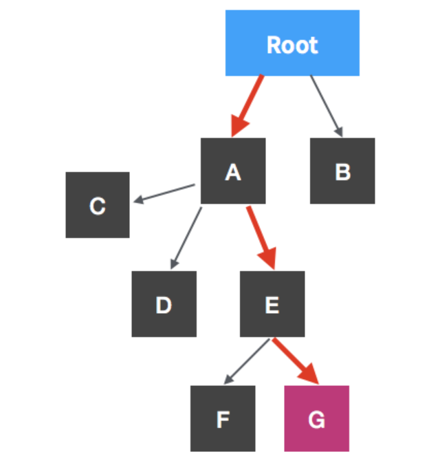
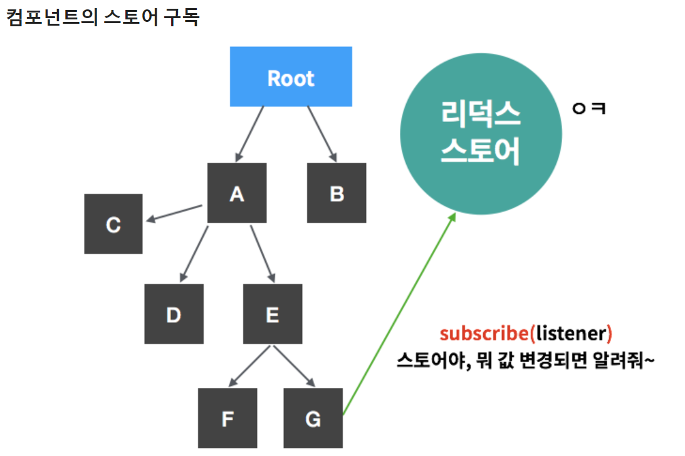
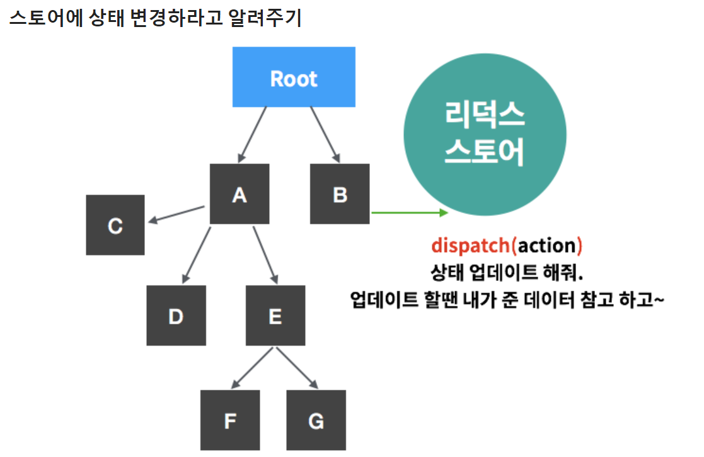

# Redux

## 리덕스의 필요성
리액트에서는 보통 하나의 루트 컴포넌트 (App.js) 에서 상태를 관리한다. 따라서 props의 관리에 불필요한 리소스가 생기며 상태관리도 복잡해진다.



```js
<A value={5}>

<E value={this.props.value} />

<G value={this.props.value} />
```

`하지만 리덕스를 쓰면, 상태 관리를 독립된 스토어에서 한다!`



> 구독의 과정 : 특정함수를 스토어에 전달 👉 추후 스토어의 상태값에 변동 발생시 전달 받았던 함수를 호출




> 상태 변경 과정 : dispatch함수를 통해 action(type을 필수적으로 가짐)을 스토어에게 전달 👉 스토어는 action과 type을 참조해서 변경

#### ✔ 리듀서를 통한 상태변경

- 액션 객체와 함께 전달받은 type에 따라서 실행되는(업데이트 되는) 함수를 리듀서라고 한다!! 

- 리듀서 함수는 state(현재상태), action(액션 객체) 두가지를 받는다.

- 이렇게 두가지 파라미터를 참조해서 새로운 상태를 반환하고 구독하고 있던 객체들에게 알려 re-rendering

## redux 예제
```html
<!DOCTYPE html>
<html>
<head>
  <meta charset="utf-8">
  <meta name="viewport" content="width=device-width">
  <title>그냥 평범한 리덕스</title>
</head>
<body>
  <h1 id="number">0</h1>
  <button id="increment">+</button>
  <button id="decrement">-</button>
<script src="https://cdnjs.cloudflare.com/ajax/libs/redux/3.6.0/redux.js"></script>
</body>
</html>
```

```js
counter.js
const elNumber = document.getElementById('number');
const btnIncrement = document.getElementById('increment');
const btnDecrement = document.getElementById('decrement');

// 액션 타입 정의 ✔
const INCREMENT = 'INCREMENT';
const DECREMENT = 'DECREMENT';

// 액션 객체를 만들어주는 액션 생성 함수 ✔
const increment = (diff) => ({ type: INCREMENT, diff: diff });
const decrement = () => ({ type: DECREMENT });

// 초기값 설정
const initialState = {
  number: 0
};

/* 
   리듀서 함수 ✔
   state 와 action 을 파라미터로 받아옵니다.
   그리고 그에 따라 다음 상태를 정의 한 다음에 반환해줍니다.
*/          

// state = initialState로 파라미터의 기본값을, 그리고 action을 넣어준다.
const counter = (state = initialState, action) => {
  console.log(action);
  switch(action.type) { // action에는 type을 필수적으로 가져아함
    case INCREMENT: // action type에 대한 case 분리
      return { 
        number: state.number + action.diff
      };
    case DECREMENT:
      return { 
        number: state.number - 1
      };
    default:
      return state;
  }
}

// 스토어를 만들 땐 createStore 에 리듀서 함수를 넣어서 호출 ✔
const { createStore } = Redux;
const store = createStore(counter);


// 상태가 변경 될 때 마다 호출시킬 listener 함수입니다
const render = () => {
  elNumber.innerText = store.getState().number;
  console.log('내가 실행됨');
}

// 스토어에 구독을하고, 뭔가 변화가 있다면, render 함수를 실행합니다.
store.subscribe(render);

// 초기렌더링을 위하여 직접 실행시켜줍니다.
render();


// 버튼에 이벤트를 달아줍니다.
// 스토어에 변화를 일으키라고 할 때에는 dispatch 함수에 액션 객체를 넣어서 호출 ✔✔✔

btnIncrement.addEventListener('click', () => {
  store.dispatch(increment(25));
})


btnDecrement.addEventListener('click', () => {
  store.dispatch(decrement());
})
```